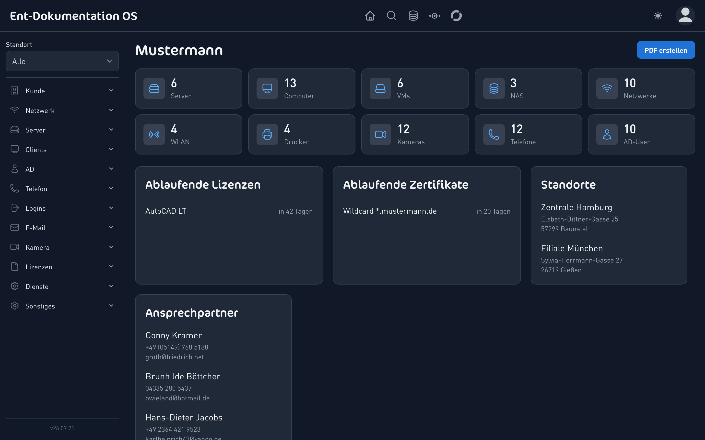
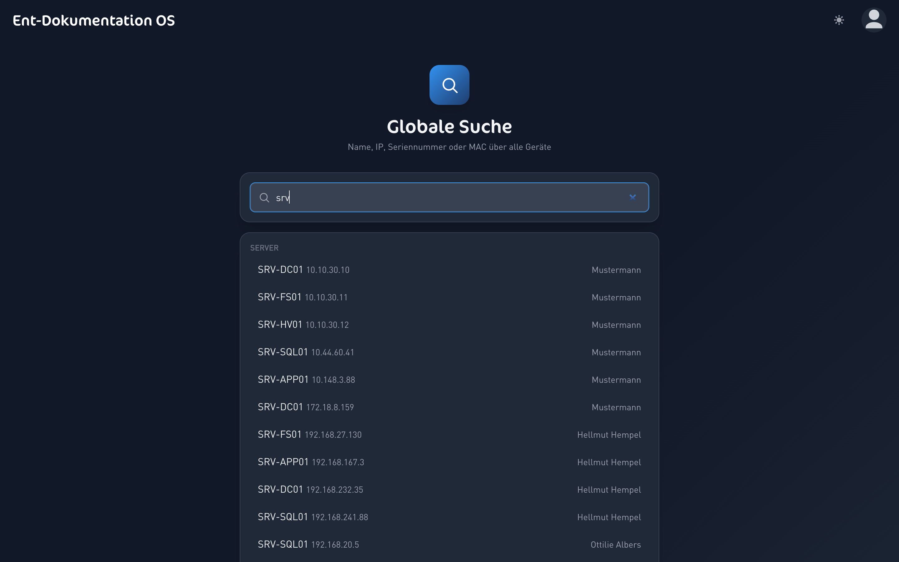
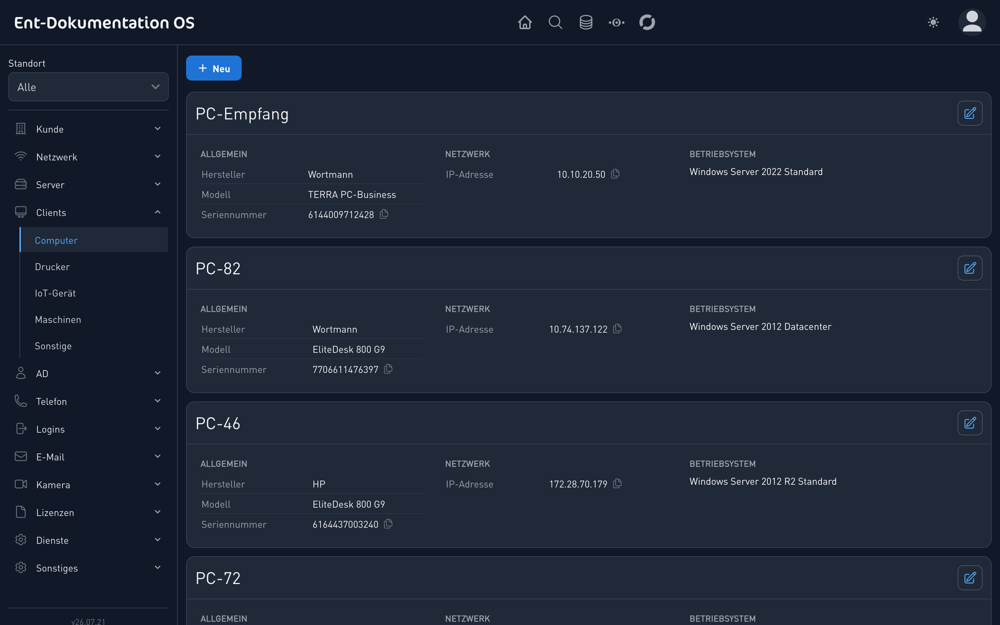
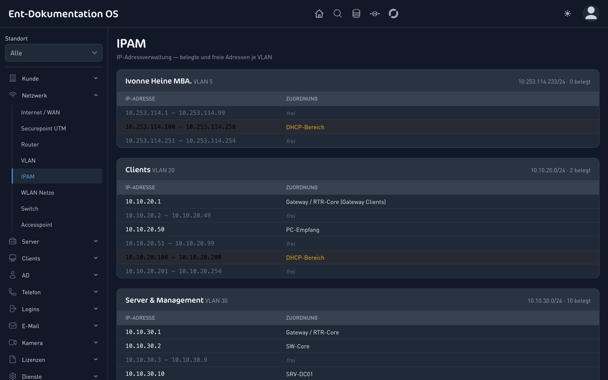
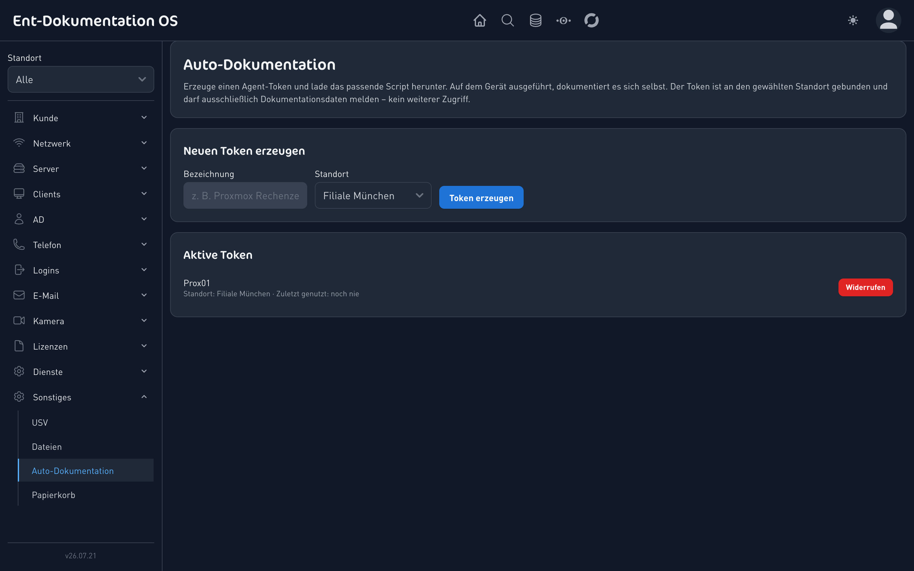
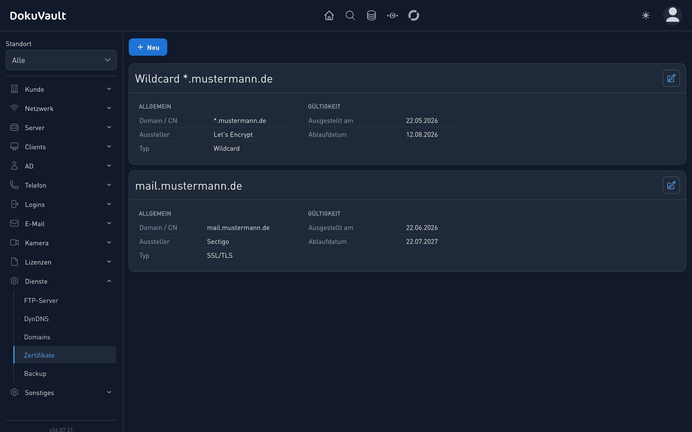

<div align="center">

# 📘 Dokumentation OS

### Die Open-Source-IT-Dokumentation für Managed Service Provider

Zentrale, mandantenfähige Dokumentation der **kompletten Kunden-IT** – vom Standort über Server,
Netzwerk und Active Directory bis zu Lizenzen und Zugangsdaten. Mit PDF-Export, globaler Suche
über alle Kunden und Geräten, die sich per Agent **selbst dokumentieren**.

[](https://github.com/PhilippKuhlmann/dokumentation-os/actions/workflows/tests.yml)


<br>



</div>

---

## ✨ Warum Dokumentation OS?

MSPs verlieren Zeit mit verstreuten Excel-Listen, veralteten Wikis und „wo stand das nochmal?".
**Dokumentation OS** bündelt alles an einem Ort – strukturiert, durchsuchbar, verschlüsselt und
immer aktuell.

|  |  |
| --- | --- |
| 🏢 **Mandantenfähig** | Jeder Kunde mit eigenen Standorten, Geräten und Zugängen – sauber getrennt |
| 🔎 **Globale Suche** | Server, IP, Seriennummer oder MAC über **alle** Kunden in Sekunden finden |
| 🤖 **Auto-Dokumentation** | Ein Script auf dem Gerät – der Rest dokumentiert sich selbst (Proxmox u. a.) |
| 🌐 **IPAM** | Belegte & freie IP-Adressen je VLAN auf einen Blick, DHCP- und Gateway-Erkennung |
| 🔐 **Verschlüsselt** | Alle Passwörter verschlüsselt gespeichert, rollenbasierte Zugriffe, Audit-Log |
| 📄 **PDF-Export** | Komplette Kundendokumentation auf Knopfdruck als PDF |
| 🌙 **Hell & Dunkel** | Modernes, responsives UI – auch auf dem Smartphone |
| ⏰ **Ablauf-Warnungen** | Lizenzen, Zertifikate & Domains laufen nie unbemerkt ab |

---

## 📸 Screenshots

<table>
  <tr>
    <td width="50%"><br><sub><b>Kunden-Dashboard</b> – Inventar, ablaufende Lizenzen & Zertifikate auf einen Blick</sub></td>
    <td width="50%"><br><sub><b>Globale Suche</b> – über alle Gerätetypen und Kunden hinweg</sub></td>
  </tr>
  <tr>
    <td width="50%"><br><sub><b>Geräte</b> – übersichtliche Karten, IP/Seriennummer per Klick kopieren</sub></td>
    <td width="50%"><br><sub><b>IPAM</b> – belegte und freie Adressen je VLAN</sub></td>
  </tr>
  <tr>
    <td width="50%"><br><sub><b>Auto-Dokumentation</b> – Agent-Token erzeugen, Script ausführen, fertig</sub></td>
    <td width="50%"><br><sub><b>SSL/TLS-Zertifikate</b> – mit Ablauf-Warnung im Dashboard</sub></td>
  </tr>
</table>

---

## 🤖 Auto-Dokumentation – Geräte dokumentieren sich selbst

Schluss mit manuellem Abtippen. Erzeuge in der Oberfläche einen **an Kunde und Standort gebundenen
Agent-Token**, lade das passende Script herunter und führe es auf dem Gerät aus – die Infrastruktur
landet automatisch in der Doku. Wiederholte Läufe aktualisieren, statt zu duplizieren.

```bash
# Auf dem Proxmox-Host als root:
bash proxmox-doku.sh
```

Der Proxmox-Agent erfasst Host-Hardware, Seriennummer, IP und **alle VMs & LXC-Container** (inkl.
IP über den QEMU-Gast-Agent) und legt sie als Server samt Gästen an. Der Token darf **ausschließlich
dokumentieren** – bei einem Leak kein weiterer Zugriff. Weitere Agenten (Windows/Hyper-V …) folgen.

---

## 🧩 Funktionsumfang

- **Kunden & Standorte** – mehrmandantenfähige Struktur je Kunde
- **Infrastruktur** – Server, VMs (mit Host-Zuordnung), NAS, Computer, Racks, USV, Maschinen, IoT
- **Netzwerk** – Router, Switches, Access Points, WLAN, VLANs, **IPAM**, Internet/WAN, UTM-Firewalls
- **Active Directory** – Domains, Benutzer, Gruppen
- **Kommunikation** – Telefonanlagen, DECT, E-Mail-Postfächer, E-Mail-Archivierung
- **Sicherheit & Zertifikate** – SSL/TLS-Zertifikate mit Ablauf-Warnung
- **Geräte** – Kameras, Recorder, Drucker
- **Dienste** – FTP, DynDNS, Domains, Backups
- **Lizenzen** – Software-, Windows- und Zugriffslizenzen inkl. Ablaufdaten & Datei-Upload
- **Zugangsdaten** – verschlüsselte Logins, Passwort anzeigen & kopieren
- **Betrieb** – globale Suche, Audit-Log, Papierkorb (Wiederherstellen), PDF-Export, Dateiablage

---

## 🔒 Sicherheit

- Passwörter & sensible Felder **verschlüsselt at rest** (`Crypt`)
- **Rollenbasierte** Zugriffe (Admin / Techniker / Kunde) mit granularen Berechtigungen
- **Audit-Log** aller Änderungen (ohne Klartext-Passwörter)
- Schutz gegen **IDOR** (fremde Kunden-/Standortzuweisung), XSS-Härtung, verschlüsselte Sessions
- Verantwortungsvolle Meldung von Lücken über [SECURITY.md](SECURITY.md)

---

## ⚙️ Tech-Stack

| Bereich | Eingesetzt |
| --- | --- |
| **Backend** | PHP 8.2 · Laravel 12 · Livewire 3.8 · Laravel Sanctum 4 *(Agent-/API-Token)* |
| **Pakete** | spatie/laravel-activitylog 4.12 *(Audit-Log)* · spatie/laravel-pdf 1.9 *(PDF via Browsershot/Puppeteer)* · spatie/laravel-backup 9.4 |
| **Frontend** | Tailwind CSS 3.2 · Alpine.js 3 · Flowbite 1.6 · Vite 3 |
| **Datenbank** | MySQL / MariaDB |
| **Qualität** | Pest 3 *(134 Tests)* · Laravel Pint · GitHub Actions CI |

---

## 📦 Installation

Voraussetzungen: PHP 8.2+, Composer, Node.js, MySQL/MariaDB.

```bash
# 1. Klonen
git clone https://github.com/PhilippKuhlmann/dokumentation-os.git
cd dokumentation-os

# 2. Abhängigkeiten
composer install
npm install

# 3. Konfiguration
cp .env.example .env          # .env anpassen (DB-Zugang etc.)
php artisan key:generate

# 4. Datenbank + Demo-Daten
php artisan migrate:fresh --seed

# 5. Frontend + Start
npm run dev
```

Danach im Browser öffnen und mit einem der Demo-Zugänge anmelden.

---

## 👥 Rollen & Demo-Zugänge

| Rolle         | Rechte                                              |
| ------------- | --------------------------------------------------- |
| **Admin**     | Systemeinstellungen ändern, Zugriff auf alle Kunden |
| **Techniker** | Zugriff auf alle Kunden                             |
| **Kunde**     | Sieht nur die eigenen Daten                         |

> ⚠️ **Nur für lokale Test-/Demo-Umgebungen.** Für den Produktivbetrieb eigene Benutzer anlegen
> und die Demo-Accounts entfernen.

| Benutzername | Passwort   | Rolle     |
| ------------ | ---------- | --------- |
| `admin`      | `password` | Admin     |
| `techniker`  | `password` | Techniker |

---

## 🧪 Tests

```bash
php artisan test
```

---

## 🤝 Mitwirken & Lizenz

Beiträge sind willkommen – siehe [CONTRIBUTING.md](CONTRIBUTING.md) und
[CODE_OF_CONDUCT.md](CODE_OF_CONDUCT.md). Sicherheitslücken bitte gemäß [SECURITY.md](SECURITY.md)
melden (nicht als öffentliches Issue).

Veröffentlicht unter der [MIT-Lizenz](LICENSE).
